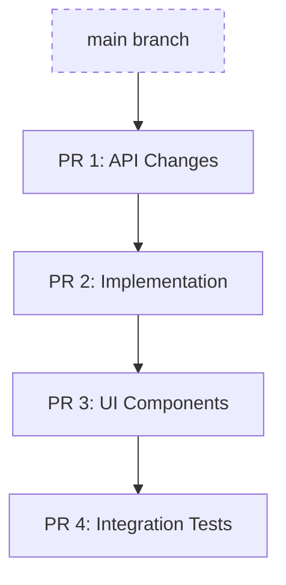

# Stackit

[](https://github.com/jonnii/stackit/actions/workflows/test.yml)

**Stackit** is a command-line tool that makes working with stacked changes fast and intuitive.

## What is Stacking?

Stacked changes (or "stacked diffs") is a development workflow where you break a large feature into a sequence of small, focused branches that build on top of each other. Instead of one massive Pull Request, you have a "stack" of smaller PRs.

### How it helps engineers:

- **Faster Reviews**: Reviewers can process small, 50-line PRs much faster than a single 500-line PR.
- **Parallel Work**: You don't have to wait for a PR to be merged before starting the next part of your feature. Just stack a new branch on top.
- **Incremental Shipping**: Parts of a feature can be merged and deployed as they are approved, reducing the risk of large, complex merges.
- **Cleaner History**: Each PR represents a logical step in your feature's development, making the Git history easier to follow.

### The Stacked Workflow



Stackit manages the complexity of this workflow—automatically handling rebases, keeping track of parent-child relationships, and submitting the entire stack to GitHub with a single command.

---

## Features

- 🌳 **Visual branch tree** — See your entire stack at a glance with `stackit log`
- 🔄 **Automatic restacking** — Keep all branches up to date when you rebase or modify a parent
- 📤 **Submit entire stacks** — Push all branches and create/update PRs in one command
- 🔀 **Smart merging** — Merge stacks bottom-up or squash top-down
- 🔧 **Absorb changes** — Automatically amend changes to the right commit in your stack
- 🧭 **Easy navigation** — Move `up`, `down`, `top`, or `bottom` of your stack
- 🧹 **Auto cleanup** — Detect and delete merged branches during `sync`
- 🤖 **AI-Assisted** — `stackit analyze` uses AI to suggest how to split your changes into a stack

---

## Installation

### Homebrew (macOS and Linux)

```bash
brew install jonnii/tap/stackit
```

### From Source

Requires Go 1.25+:

```bash
git clone https://github.com/jonnii/stackit
cd stackit
go build -o stackit ./cmd/stackit
# Move to your PATH
mv stackit /usr/local/bin/
```

### Using Just

If you have [just](https://github.com/casey/just) installed:

```bash
just build
just install
```

---

## Getting Started

### 1. Initialize Stackit
In your repository, run:
```bash
stackit init
```
This detects your trunk branch (usually `main`) and prepares the repo for stacking.

### 2. Create your first branch
Stage some changes, then create a branch:
```bash
git add internal/api.go
stackit create add-api -m "feat: add base api"
```

### 3. Stack another branch on top
Make more changes and create another branch:
```bash
git add internal/logic.go
stackit create add-logic -m "feat: implement logic"
```

### 4. Visualize the stack
See your current position in the stack:
```bash
stackit log
```
```
main
│
├─◯ add-api
│ │
│ └─● add-logic ← you are here
```

### 5. Submit your PRs
Submit the entire stack to GitHub:
```bash
stackit submit
```
This pushes both branches and creates two PRs on GitHub, with `add-logic` correctly pointing its base to `add-api`.

---

## Command Reference

### Navigation
| Command | Description |
|:---|:---|
| `stackit log` | Display the branch tree (aliases: `l`, `ls`, `ll`) |
| `stackit checkout` | Interactive branch switcher |
| `stackit up` / `down` | Move to the child or parent branch |
| `stackit top` / `bottom` | Move to the top or bottom of the stack |
| `stackit trunk` | Return to the main/trunk branch |

### Branch Management
| Command | Description |
|:---|:---|
| `stackit create [name]` | Create a new branch on top of current |
| `stackit modify` | Amend the current commit (like `git commit --amend`) |
| `stackit absorb` | Intelligently amend changes to the correct commits in the stack |
| `stackit split` | Split the current branch's commits into multiple branches |
| `stackit squash` | Squash all commits on the current branch |
| `stackit fold` | Merge the current branch into its parent |
| `stackit pop` | Delete current branch but keep its changes in working tree |
| `stackit delete` | Delete the current branch and its metadata |

### Stack Operations
| Command | Description |
|:---|:---|
| `stackit restack` | Rebase all branches in the stack to ensure proper ancestry |
| `stackit submit` | Push branches and create/update GitHub PRs |
| `stackit sync` | Pull trunk, delete merged branches, and restack |
| `stackit merge` | Merge PRs in the stack (bottom-up or top-down) |
| `stackit reorder` | Interactively reorder branches in your stack |
| `stackit move` | Rebase a branch (and its children) onto a new parent |

### AI & Automation
| Command | Description |
|:---|:---|
| `stackit analyze` | AI analyzes staged changes and suggests a stack structure |
| `stackit agent init` | Setup integration files for Cursor and Claude Code |

### Utilities & System
| Command | Description |
|:---|:---|
| `stackit undo` | Restore the repository to a state before a command |
| `stackit doctor` | Diagnose and fix issues with your stackit setup |
| `stackit info` | Show detailed info about the current branch |
| `stackit track` / `untrack` | Manually start/stop tracking a branch with stackit |
| `stackit config` | Manage stackit configuration |
| `stackit continue` / `abort` | Continue or abort an interrupted operation (like a rebase) |

---

## Common Workflows

### Updating after Code Review
If you receive feedback on a branch in the middle of your stack:
1. `stackit checkout <branch>` to move to that branch.
2. Make your changes and run `stackit modify`.
3. Run `stackit restack` to update all child branches.
4. Run `stackit submit` to update the PRs on GitHub.

### Using `stackit absorb`
`absorb` is like magic for stacked PRs. If you have small fixes for multiple branches in your stack, just stage them all and run `stackit absorb`. Stackit will figure out which changes belong to which branch and amend them automatically.

### Syncing with the Main Branch
To keep your stack up-to-date with `main`:
```bash
stackit sync
```
This pulls the latest changes from `main`, deletes branches that have already been merged, and restacks your remaining branches on top of the new `main`.

---

## Requirements

- **Git 2.25+**
- **GitHub CLI (`gh`)** for PR operations
- **Go 1.25+** (if building from source)

## Development

```bash
# Run tests and linter
just check

# Build locally
just build
```

## Philosophy

1. **Safety First**: Operations are non-destructive and can be undone with `stackit undo`.
2. **Speed**: Common operations should be fast and require minimal context switching.
3. **Visibility**: You should always know exactly where you are in your stack.
4. **Git Native**: Stackit uses standard Git refs and metadata under the hood.

## License

MIT
