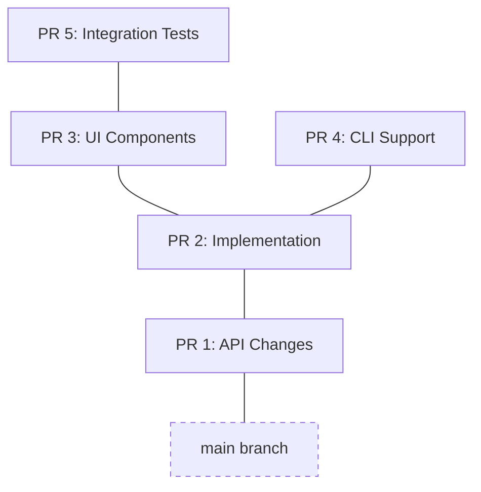

# Stackit

[](https://github.com/getstackit/stackit/actions/workflows/test.yml)

**Stackit** is a command-line tool that makes working with stacked changes fast and intuitive.

## Table of Contents

- [What is Stacking?](#what-is-stacking)
- [Features](#features)
- [Installation](#installation)
- [Getting Started](#getting-started)
- [Command Reference](#command-reference)
- [Common Workflows](#common-workflows)
- [AI Agent Integration](#ai-agent-integration)
- [Branch Protection](#frozen--locked-branches)
- [Configuration](#configuration)
- [Troubleshooting](#troubleshooting)
- [Contributing](#contributing)

---

## What is Stacking?

Stacked changes (or "stacked diffs") is a development workflow where you break a large feature into small, focused branches that build on top of each other. Instead of one massive Pull Request, you have a "stack" of smaller PRs. Stacks can be linear (a simple chain of branches) or they can branch out into a tree structure when you need to work on multiple parallel features that share a common base.

### How it helps engineers:

- **Faster Reviews**: Reviewers can process small, 50-line PRs much faster than a single 500-line PR.
- **Parallel Work**: You don't have to wait for a PR to be merged before starting the next part of your feature. Just stack a new branch on top.
- **Incremental Shipping**: Parts of a feature can be merged and deployed as they are approved, reducing the risk of large, complex merges.
- **Cleaner History**: Each PR represents a logical step in your feature's development, making the Git history easier to follow.

### The Stacked Workflow


```mermaid
graph BT
    main[main branch] --- B1[PR 1: API Changes]
    B1 --- B2[PR 2: Implementation]
    B2 --- B3[PR 3: UI Components]
    B2 --- B4[PR 4: CLI Support]
    B3 --- B5[PR 5: Integration Tests]

    style main stroke-dasharray: 5 5
```

Stacks naturally form a tree structure—a single branch can have multiple children when you need to work on parallel features. Stackit manages the complexity of this workflow—automatically handling rebases, keeping track of parent-child relationships, and submitting the entire stack to GitHub with a single command.

---

## Features

- 🌳 **Visual branch tree** — See your entire stack at a glance with `stackit tree`
- 🔄 **Automatic restacking** — Keep all branches up to date when you rebase or modify a parent
- 📤 **Submit entire stacks** — Push all branches and create/update PRs in one command with progress tracking
- 🔀 **Smart merging** — Merge stacks bottom-up or squash top-down
- 🔧 **Absorb changes** — Automatically amend changes to the right commit in your stack
- 🧭 **Easy navigation** — Move `up`, `down`, `top`, or `bottom` of your stack
- 🧹 **Auto cleanup** — Detect and delete merged branches during `sync`
- 🎯 **Smart scoping** — Associate branches with Jira tickets, Linear IDs, or other logical scopes
- 🔒 **Branch protection** — `lock` or `freeze` branches to prevent accidental modifications
- 🔍 **Branch inspection** — Easily see parent/child relationships with `children` and `parent` commands
- ⚙️ **Advanced configuration** — Customize branch naming patterns and submit behavior
- 🤖 **AI assistant integration** — Generate integration files for Cursor, Claude Code, and Codex
- 🐙 **GitHub Integration** — Install CI checks to prevent merging locked PRs
- ⚓ **Git Hooks** — Automatically validate branch state before committing with `precommit`
- 📂 **Worktrees** — Work on multiple stacks in parallel with dedicated directories and post-creation hooks
- 🧪 **Web dashboard** *(experimental)* — Visualize your stacks in a swimlane dashboard with real-time updates ([docs](docs/web.md))

---

## Installation

### Homebrew (macOS and Linux)

```bash
brew install getstackit/tap/stackit
```

After installation, you can use either `stackit` or `st`, and `worktree` or `wt`.

### Homebrew Server (Web UI + API)

```bash
brew install getstackit/tap/stackit-server
stackit-server --port 8080
```

Open `http://localhost:8080` to use the web UI.

### Shell Integration (Recommended)

Enable shell integration to automatically change directories when creating worktrees with `stackit create -w`. Add one of the following to your shell configuration:

```bash
# For zsh (~/.zshrc):
eval "$(stackit shell zsh)"

# For bash (~/.bashrc):
eval "$(stackit shell bash)"

# For fish (~/.config/fish/config.fish):
stackit shell fish | source
```

This is separate from shell completions. You likely want both:

```bash
# zsh example:
eval "$(stackit completion zsh)"
eval "$(stackit shell zsh)"
```

---

## Getting Started

### 1. Initialize Stackit
In your repository, run:
```bash
stackit init
```
This detects your trunk branch (usually `main`) and prepares the repo for stacking. You'll be prompted to install optional integrations (GitHub Actions, pre-commit hooks, AI agent files).

### 2. Create your first branch
Stage some changes, then create a branch:
```bash
git add internal/api.go
stackit create add-api -m "feat: add base api"
```

### 3. Stack another branch on top
Make more changes and create another branch:
```bash
git add internal/logic.go
stackit create add-logic -m "feat: implement logic"
```

### 4. Visualize the stack
See your current position in the stack:
```bash
stackit tree
```
```
● add-logic ← you are here
│
◯ add-api
│
main
```

Stacks can also branch when you have parallel work:
```
◯ add-tests
│
│ ● add-ui ← you are here
├─┘
◯ add-logic
│
◯ add-api
│
main
```

### 5. Submit your PRs
Submit the entire stack to GitHub:
```bash
stackit submit
```
This pushes both branches and creates two PRs on GitHub, with `add-logic` correctly pointing its base to `add-api`.

### 6. Merge your stack
Once your PRs are approved, merge the entire stack:
```bash
stackit merge          # Interactive wizard
stackit merge next     # Merge bottom PR, then restack
stackit merge ship     # Consolidate into single PR and merge
```
- `stackit merge` launches an interactive wizard to guide you through merging
- `stackit merge next` merges the bottom-most unmerged PR using GitHub automerge, then restacks remaining branches
- `stackit merge ship` consolidates all branches into a single PR for atomic merging

---

## AI Agent Integration

Stackit includes specialized skills for Claude Code and Codex, providing intelligent automation for common stacking workflows. These skills understand stack context and can perform complex operations with minimal user input.

### Available Agent Skills

| Command | Description | When to Use |
|:---|:---|:---|
| `stack-status` | View current stack state, branch position, and health status | Getting oriented in a complex stack |
| `stack-create [branch-name]` | Create a new stacked branch with intelligent naming and commit messages | Adding a new feature branch to your stack |
| `stack-submit [--stack \| --draft]` | Submit branches as PRs with auto-generated descriptions | Creating or updating pull requests |
| `stack-sync` | Sync with trunk, cleanup merged branches, and restack | Keeping your stack up-to-date with main |
| `stack-restack` | Rebase branches with scoped or multi-stack targeting | Fixing branch relationships after changes |
| `stack-absorb` | Intelligently absorb working changes into correct commits | Applying fixes across multiple stack branches, with conflict resolution guidance |
| `stack-fix` | Diagnose and fix common stack issues | Resolving compilation errors or structural problems |
| `stack-describe` | Generate or update stack description from changes | Documenting your stack for PRs |

### Setting Up AI Agent Integration

```bash
stackit agent install
```

This creates integration files for Claude Code, Codex, and Cursor.

Generated files include:

- `~/.claude/skills/stackit/` plus `~/.claude/skills/stack-*/` for Claude Code
- `~/.codex/skills/stackit/` plus `~/.codex/skills/stack-*/` for Codex
- Repository workflow guidance for `CLAUDE.md` or `AGENTS.md` when you opt in

The generated skills are designed to:

- **Understand Context**: Each command analyzes your current stack state and git status
- **Provide Validation**: Commands include quality checks and error handling
- **Guide Through Issues**: When conflicts or errors occur, commands provide step-by-step resolution guidance
- **Ensure Safety**: All commands prioritize data safety and provide undo capabilities

### Example Agent Workflow

```bash
# Start Claude Code or Codex in a fresh generated worktree
stackit wt run -- claude
stackit wt run -- codex

# Inside the generated worktree, create the first real branch under its anchor
stackit create add-user-auth -m "feat: add user auth"

# Claude Code or Codex can help with complex stacking operations
# Make changes...
stack-absorb                 # Intelligently distributes changes across commits
stack-fix                    # Diagnoses and fixes any issues
stack-submit --stack         # Creates/updates all PRs in the stack
```

---

## Command Reference

### Navigation
| Command | Description |
|:---|:---|
| `stackit state` | Snapshot of the stack, working tree, and any in-progress operation (`--json` for a complete machine-readable snapshot) |
| `stackit tree` | Display the branch tree |
| `stackit t` | Display the short branch tree (`stackit tree short`) |
| `stackit log` | Show trunk commit history with consolidated stacks collapsed |
| `stackit checkout` | Interactive branch switcher |
| `stackit up` / `down` | Move to the child or parent branch |
| `stackit top` / `bottom` | Move to the top or bottom of the stack |
| `stackit trunk` | Return to the main/trunk branch |
| `stackit children` | Show the children of the current branch |
| `stackit parent` | Show the parent of the current branch |
| `stackit share` | Print the current stack as Slack-ready markdown for copy-paste |
| `stackit pr [branch\|number]` | Open a pull request in the default browser (`--stack` for the stack's root PR) |

### Branch Management
| Command | Description |
|:---|:---|
| `stackit create [name]` | Create a new branch on top of current (use `-w` to create with worktree, `--onto <branch>` to target a specific parent without checking it out) |
| `stackit modify` | Amend the current commit (like `git commit --amend`; use `--into <branch>` to amend a downstack ancestor without checking it out) |
| `stackit absorb` | Intelligently amend changes to the correct commits in the stack |
| `stackit split` | Split commits into branches (by commit, hunk, or file; use `--above` for upstack) |
| `stackit squash` | Squash all commits on the current branch |
| `stackit fold` | Merge the current branch into its parent |
| `stackit pop` | Delete current branch but keep its changes in working tree |
| `stackit delete` | Delete the current branch and its metadata |
| `stackit rename [name]` | Rename the current branch and update metadata |
| `stackit describe` | Set a title and description for the current stack |
| `stackit scope [name]` | Manage logical scope (Jira ticket, Linear ID) for current branch |
| `stackit lock [branch]` | Lock a branch and its downstack (prevent local changes) |
| `stackit unlock [branch]` | Unlock a branch and its upstack (allow local changes) |
| `stackit freeze [branch]` | Freeze a branch (prevent local changes, local only) |
| `stackit unfreeze [branch]` | Unfreeze a branch |

### Worktree Management
| Command | Description |
|:---|:---|
| `stackit worktree create <name>` | Create a new worktree (auto-cd with shell integration; use `--no-open` to skip) |
| `stackit worktree list` | List all managed worktrees |
| `stackit worktree remove <stack>` | Remove an empty managed worktree and delete its hidden anchor (`--force` discards dirty files only) |
| `stackit worktree open <stack>` | Open a worktree (auto-cd with shell integration, or print path for `cd $(...)`) |
| `stackit worktree attach <branch>` | Move an existing stack into a managed worktree by inserting a hidden anchor above it |
| `stackit worktree detach <name>` | Remove a managed worktree but keep and reparent its real branches |
| `stackit worktree prune` | Clean up empty or stale managed worktrees |
| `stackit worktree run -- <cmd>` | Create a generated anchored worktree and run a command inside it |
| `stackit worktree repair [name]` | Repair stale or legacy managed worktree registrations |

### Stack Operations
| Command | Description |
|:---|:---|
| `stackit flatten` | Move branches closer to trunk where possible |
| `stackit restack` | Rebase branches to ensure proper ancestry (`--branch X --upstack`, `--all-stacks`, `--stacks root1,root2`, `--parallel`) |
| `stackit get [branch\|PR]` | Sync a stack or specific PR from remote |
| `stackit foreach` | Run a shell command on each branch (`--upstack`, `--all-stacks`, `--stacks`, `--parallel`) |
| `stackit submit` | Push branches and create/update GitHub PRs (alias: `ss` for `--stack`) |
| `stackit sync` | Pull trunk, delete merged branches, and restack |
| `stackit merge` | Interactive merge wizard (use `merge next` or `merge ship` for non-interactive) |
| `stackit reorder` | Interactively reorder branches in your stack |
| `stackit move` | Rebase a branch (and its children) onto a new parent |
| `stackit pluck` | Extract a single branch from a stack (reparents children to grandparent) |

### Integrations
| Command | Description |
|:---|:---|
| `stackit agent install` | Setup integration files for Cursor, Claude Code, and Codex |
| `stackit github install` | Install GitHub Action CI checks for branch locking |
| `stackit precommit install` | Install git pre-commit hook for branch state validation |
| `stackit precommit uninstall` | Remove the git pre-commit hook |
| `stackit prepush install` | Install git pre-push hook for branch state validation (also `uninstall`, `verify`) |

### Utilities & System
| Command | Description |
|:---|:---|
| `stackit undo` | Restore the repository to a state before a command |
| `stackit doctor` | Diagnose and fix issues with your stackit setup |
| `stackit info` | Show detailed info about the current branch |
| `stackit track` / `untrack` | Manually start/stop tracking a branch with stackit |
| `stackit config` | Manage stackit configuration |
| `stackit ui` | Open the shippable work dashboard in the local web UI |
| `stackit debug` | Dump debugging information about recent commands and stack state |
| `stackit continue` / `abort` | Continue or abort an interrupted operation (like a rebase) |

### Global Flags

These flags are available on all `stackit` commands:

| Flag | Description |
|:---|:---|
| `--cwd <path>` | Working directory in which to perform operations. |
| `--debug` | Write debug output to the terminal. |
| `--interactive` | Enable interactive features like prompts, pagers, and editors. (Default: true) |
| `--no-interactive` | Disable all interactive features. |
| `--verify` | Enable git hooks (pre-commit, etc.). (Default: true) |
| `--no-verify` | Disable git hooks. |
| `--quiet`, `-q` | Minimize output to the terminal. Implies `--no-interactive`. |

---

## Common Workflows

### Updating after Code Review
If you receive feedback on a branch in the middle of your stack:
1. `stackit checkout <branch>` to move to that branch.
2. Make your changes and run `stackit modify`.
3. Run `stackit restack --upstack` to update child branches (or `--all-stacks` to cover every independent stack).
4. Run `stackit submit` to update the PRs on GitHub.

### Using `stackit absorb`
`absorb` is like magic for stacked PRs. If you have small fixes for multiple branches in your stack, just stage them all and run `stackit absorb`. Stackit will figure out which changes belong to which branch and amend them automatically.

### Flattening a Stack
After landing PRs from the middle of a stack, or when you have independent changes that were developed as a chain but don't actually depend on each other, use `flatten` to move branches closer to trunk:
```bash
stackit flatten
```
This analyzes each branch and tests whether it can be rebased directly onto trunk (or closer to it). Branches that depend on changes from their parent will stay in place.

### Syncing with the Main Branch
To keep your stack up-to-date with `main`:
```bash
stackit sync
```
This pulls the latest changes from `main`, deletes branches that have already been merged, and restacks your remaining branches on top of the new `main`.

**Safety:** Sync protects branches that have unpushed local commits. If a branch has been merged on GitHub but has local commits that were never pushed, sync will skip deleting it and warn you, preventing accidental data loss.

### Working on Multiple Stacks in Parallel
To work on separate features simultaneously, each in their own directory:
```bash
# Create a new stack with its own worktree
stackit create my-feature -m "feat: start new feature" -w

# This creates:
# - A hidden worktree anchor branch at trunk
# - A new branch 'my-feature' parented under that anchor
# - A worktree at ../your-repo-stacks/my-feature/
```
Navigate to the worktree:
```bash
# With shell integration: auto-changes directory
stackit worktree open my-feature

# Without shell integration: use command substitution
cd $(stackit worktree open my-feature)
```

To hand a fresh isolated workspace to an AI coding tool without choosing a name:
```bash
stackit wt run -- claude
stackit wt run -- codex
```
Stackit generates the worktree name, creates a hidden anchor at trunk, and runs the tool inside that worktree. When the tool exits, your shell stays in the original directory. The first `stackit create` run inside that worktree creates the first real branch under the anchor.

During `stackit sync`, Stackit can automatically clean up managed worktrees that are clean and empty after merged or deleted branches are removed.

If you upgrade from an older Stackit version with pre-anchor managed worktrees, run `stackit worktree list` once. Any `legacy` or `repair` entries can be migrated in place with `stackit worktree repair`.

#### Warm-starting new worktrees

A new worktree is a fresh checkout, so ignored files your build needs — `.env`, dependency caches — aren't there. Add a `.worktreeinclude` file at the repository root to copy selected ignored files into every new managed worktree:

```gitignore
# .worktreeinclude — .gitignore syntax, selects from files Git already ignores
.env
.env.local
node_modules/
```

The copy runs before `post-worktree-create` hooks, so setup hooks can use the warmed files. A pattern can never copy a tracked file, and existing files are never overwritten.

Warm-started files are ignored by Git, so nothing else has a copy of them: `worktree remove`, `worktree prune`, and `worktree detach` all delete the worktree directory and everything in it. See [docs/worktree.md](docs/worktree.md#warm-starts) for the full safety rules.

#### Run stack commands from the worktree that owns the stack

Commands that change branch content — `create`, `modify`, `absorb`, `fold`, `squash`, `split`, `move`, `reorder`, `pluck`, `delete`, `track` — must run in the worktree that owns the stack, so the edit lands in the working tree you're actually looking at. From anywhere else Stackit refuses and tells you where to go:

```
branch payments-api belongs to worktree payments; run this command from there: cd ../myapp-stacks/payments
```

`sync` and `restack` are the exception: they reconcile the whole repository and can run from any worktree, but skip branches whose worktree has uncommitted changes. See [docs/worktree.md](docs/worktree.md) for details.

Inside a managed worktree, `stackit create` builds on that worktree's own stack, so creating a branch directly from trunk there is refused — check out a branch the worktree owns first.

### Collaborating on Stacks
To work on a stack created by someone else or on another machine:
```bash
# Sync an entire stack by providing a PR number or branch name
stackit get 123
```
By default, `get` **freezes** the fetched branches locally. This prevents accidental local modifications while you build on top of them, without affecting the original author's metadata. Use `stackit unfreeze` if you need to modify them.

If part of the stack has already merged and GitHub deleted those branches, `get` tracks what is left against the nearest branch that still exists — usually trunk — and says which landed branch it moved past. The fetched branch still contains the landed commits until it is rebased, and a frozen branch is never rebased, so `get` offers to unfreeze and restack it there and then. Declining is fine: the branch keeps mirroring the remote, and `stackit unfreeze` followed by `stackit restack` finishes the job whenever you are ready.

Occasionally there is nothing on the remote recording which commit the branch was pushed on top of — a branch pushed without stackit whose parent has since merged. `get` still re-anchors it, but it says the landed commits can't be told apart from the branch's own and leaves it frozen, because rebasing it would duplicate the merged work rather than drop it.

### Native GitHub Stack Sync (Experimental)

GitHub's native stacked PR UI requires a linear PR chain. To reconcile its server-side Stack metadata automatically during normal submission, enable the option once:

```bash
stackit config set stack.shape linear
stackit config set github.stack true
stackit submit
```

With this option enabled, submissions containing two or more PRs reconcile GitHub's server-side Stack resource. Single-PR submissions behave normally.

Sync configured this way is best-effort: if the stack is not a linear chain, or the Stacks API is unavailable for the repository, `submit` reports the reason and completes normally rather than failing. Use `stackit submit --with-native-stack` for a one-off sync that fails loudly instead.

---

## Frozen & Locked Branches

Stackit provides two ways to protect branches from accidental modification.

### Frozen Branches (Local)
**Frozen** status is strictly **local** to your machine. It's the recommended way to protect branches you've fetched from others.
- **Use Case**: You want to stack your own work on top of someone else's PRs without accidentally changing their commits.
- **Behavior**: Prevents `modify`, `squash`, `absorb`, and `restack`. `st sync` will update frozen branches by hard-resetting them to their remote tracking branch instead of rebasing.
- **Commands**: `st freeze`, `st unfreeze`

### Locked Branches (Shared)
**Locked** status is **shared** with everyone collaborating on the stack via remote metadata.
- **Use Case**: You want to signal to your team that a set of branches are stable and should not be modified by anyone.
- **Behavior**: Same restrictions as frozen branches, but visible to all users who `st get` or `st sync` the stack.
- **Commands**: `st lock`, `st unlock`

---

### Automation & CI
Stackit is designed to be easily scriptable. Use global flags to control behavior in non-interactive environments:

```bash
# Run stackit on a specific repository from a script
stackit sync --cwd /path/to/repo --no-interactive --no-verify
```

Interactive features are also disabled automatically when there is no attached
terminal (pipes, CI, agents). To force non-interactive mode without repeating
`--no-interactive` on every command — handy for AI agents and scripts — set the
environment variable once:

```bash
export STACKIT_NO_INTERACTIVE=1
stackit create -F - < msg.txt   # no --no-interactive needed
```

An explicit `--interactive` always overrides both the env var and TTY detection.

For machine-readable status, **`stackit state --json`** is the single snapshot to
read: the current branch and trunk, working-tree state (`staged`/`unstaged`/
`untracked`), any in-progress `operation` (`rebase`/`merge`) with its
`conflicted_files`, and the full `stack`. The embedded `stack` is the same shape as
`stackit tree --json` — each branch reports its structure (`parent`, `children`),
PR/CI state (`pr.state`, `pr.ci_status`, `pr.review_status`), and stack health
(`needs_restack`, `is_locked`, `is_frozen`, `scope`), with the status booleans
always present (an explicit `false`, never omitted). One `stackit state --json`
call replaces combining `git status`, `stackit tree --json`, and `stackit info`
(and `stackit status` still passes through to `git status`).

`stackit log --json` is a separate trunk-history feed for release tooling. It
emits collapsed recently merged commits, not the branch tree shape.

**`stackit restack --json` never enters the interactive conflict workflow.** Like
`--continue-on-conflict`, it holds conflicted stacks back and keeps the output
stream pure JSON. A routine conflict reports `"status": "conflict"` with the
branches listed under `conflicts` and their untouched descendants under
`blocked`; `"status": "error"` is reserved for a restack that actually failed.
The repository is left on the original branch, not mid-rebase.

Because a conflict is reported as data, **it exits 0** — branch on
`.status == "conflict"` or `.conflict_count`, not on the exit code.

Restack also holds back any branch whose worktree it cannot safely reset — one
with uncommitted changes, a rebase in progress, or that cannot be inspected —
along with that branch's descendants. Held branches are reported with the
worktree and the reason, and picked up on the next restack once the worktree is
clean. In JSON they appear under `held` as `{branch, reason}` — and also in
`skipped`, so an empty `conflicts` list alone does not mean the whole stack
moved.

**`stackit sync --dry-run --json` reports `trunk_state_unknown`.** The preview
resolves the remote trunk SHA from a listing without fetching its objects, so
the ancestry check can be unresolvable — in which case trunk is neither reported
as behind nor proven current. When `trunk_state_unknown` is `true`, an absent
`would_pull` does **not** mean trunk is up to date; fetch and re-run before
acting on the preview.

Two smaller shapes changed alongside the worktree work. `stackit tree --json`
has always omitted worktree anchors from its entries, but `parent` could still
name one — a dangling reference to a branch absent from the result. Both
`parent` and `children` now resolve past anchors, so a branch under an anchor
reports the anchor's nearest visible ancestor as its parent and appears in that
ancestor's `children`. `stackit worktree list --json` gained
`ownership_warnings`, listing branches checked out somewhere their stack does
not own.

---

## Configuration

Stackit uses a layered configuration system:

1. **Personal settings** (highest priority) — Stored in `.git/config`, not shared
2. **Team settings** — Stored in `.stackit.yaml`, committed and shared with team
3. **Defaults** (lowest priority) — Built-in sensible defaults

This allows teams to define shared settings that individual developers can override locally.

### Configuration Options

| Option | Description | Example |
|:---|:---|:---|
| `trunk` | Primary trunk branch (default: main) | `stackit config set trunk main` |
| `trunks.add` | Add an additional trunk branch | `stackit config set trunks.add develop` |
| `trunks.remove` | Remove an additional trunk branch | `stackit config set trunks.remove develop` |
| `branch.pattern` | Customize how branch names are generated | `stackit config set branch.pattern "{username}/{date}/{message}"` |
| `stack.shape` | `tree` (default) or `linear`; linear mode prevents forks below non-trunk branches ([details](docs/config.md#stack-shape-stackshape)) | `stackit config set stack.shape linear` |
| `submit.footer` | Include PR footer linking back to the stack (default: true) | `stackit config set submit.footer false` |
| `merge.method` | Default merge strategy (squash, merge, or rebase) | `stackit config set merge.method squash` |
| `ci.command` | CI validation command to run with `stackit foreach` | `stackit config set ci.command "make test"` |
| `ci.timeout` | CI command timeout in seconds (default: 600) | `stackit config set ci.timeout 300` |
| `undo.depth` | Maximum undo snapshots to retain (default: 10) | `stackit config set undo.depth 20` |
| `worktree.basePath` | Customize where worktrees are created | `stackit config set worktree.basePath "../my-stacks"` |
| `worktree.autoClean` | Auto-remove clean, empty managed worktrees during sync (default: true) | `stackit config set worktree.autoClean false` |
| `split.hunkSelector` | Hunk selector mode: tui or git (default: tui) | `stackit config set split.hunkSelector git` |
| `maxConcurrency` | Maximum concurrent validation operations (default: auto) | `stackit config set maxConcurrency 4` |
| `navigation.when` | When to show navigation: always, never, or multiple (default: always) | `stackit config set navigation.when multiple` |
| `navigation.marker` | Symbol marking current PR in stack (default: 👈, max 10 chars) | `stackit config set navigation.marker "<--"` |
| `navigation.location` | Where navigation appears: body, comment, or none (default: body) | `stackit config set navigation.location comment` |
| `navigation.showMerged` | Show previously merged branches in stack navigation for historical context (default: false) | `stackit config set navigation.showMerged true` |

### Interactive Configuration
Use the interactive TUI to manage all settings:
```bash
stackit config
```

### List Current Configuration
View all current configuration values:
```bash
stackit config --list
```

### Team Configuration (`.stackit.yaml`)

For team-wide settings, create a `.stackit.yaml` file in your repository root. This file should be committed to version control and is shared across all team members. Team settings act as defaults that individual developers can override in their personal git config.

```yaml
# .stackit.yaml - Team-wide defaults
trunk: main

# Additional trunk branches (e.g., release branches)
trunks:
  - develop
  - staging

# Branch naming pattern for the team
branch:
  pattern: "{username}/{date}/{message}"

# Stack topology. Linear mode is compatible with GitHub native Stacked PRs.
stack:
  shape: tree  # tree or linear

# PR submission settings
submit:
  footer: true

# Default merge method
merge:
  method: squash

# CI validation
ci:
  command: "make test"
  timeout: 600

# Undo history
undo:
  depth: 10

# Worktree settings
worktree:
  basePath: ""
  autoClean: true

# Split settings
split:
  hunkSelector: tui

# Concurrency (0 = auto based on CPU count)
maxConcurrency: 0

# PR navigation display options
navigation:
  when: always        # always, never, or multiple (only show when stack has multiple PRs)
  marker: "👈"        # Symbol marking the current PR (max 10 chars)
  location: body      # body, comment, or none (where navigation appears)
  showMerged: false   # Show previously merged branches for historical context

# Worktree hooks
hooks:
  post-worktree-create:
    - npm install
    - cp .env.example .env
```

#### Worktree Hooks

The `hooks.post-worktree-create` option allows you to run commands automatically after Stackit creates a managed worktree, including `stackit create -w`, `stackit worktree create`, `stackit worktree attach`, and `stackit worktree run`. This is useful for:

- Installing dependencies (`npm install`, `bundle install`, etc.)
- Setting up environment files
- Running initialization scripts

**Security**: The first time a hook is encountered, Stackit prompts for approval (defaulting to "No" for safety). Approvals are stored locally in git config and persist across sessions. Hooks have a 60-second timeout.

### Performance Optimizations

Stackit uses parallel validation for rebase operations, providing 2-3x speedup for wide stacks with many sibling branches. Branches at the same depth are validated concurrently, with automatic early exit on first conflict to save resources.

For tuning remote operations (SSH connection reuse) and diagnosing a slow command with the built-in tracer, see [docs/performance.md](docs/performance.md).

---

## Troubleshooting

### "Branch not tracked by stackit"

If you see this error, the branch wasn't created with `stackit create`. You can manually track it:

```bash
stackit track
```

### Merge conflicts during restack

When `stackit restack` encounters conflicts (use `--continue-on-conflict` to skip conflicted stacks and keep going):

1. Resolve the conflicts in your editor
2. Stage the resolved files: `git add .`
3. Continue the restack: `stackit continue`

Or abort and try a different approach: `stackit abort`

`abort` puts you back exactly where you started: branches and metadata roll back
to their pre-command state, and any uncommitted changes the command consumed —
the edit `stackit modify` amended into a commit, the files `git add -A` staged
before `stackit create` — come back to your working tree with their original
staged/unstaged split. The same applies to `absorb` and `split`.

`abort` only ever rolls back the command that halted. If that command recorded
no rollback point, it says so and leaves your branches as the command left them
rather than restoring an unrelated snapshot — use `stackit undo` to pick a
state to return to.

### Recovering from a failed operation

Stackit automatically saves state before operations. To undo:

```bash
stackit undo
```

This restores branches, metadata, and the working tree to the state before the
last command, including uncommitted changes that command turned into a commit.
Because it resets the working tree onto the restored commits, `undo` refuses to
run while you have uncommitted changes of your own — commit or stash them first.

### Stack is out of sync with remote

If your local stack diverged from remote (e.g., after force-pushes by collaborators):

```bash
stackit sync
```

This pulls the latest trunk, cleans up merged branches, and restacks.

### PR base branch is wrong on GitHub

If a PR's base branch is pointing to the wrong parent:

```bash
stackit submit --stack
```

This updates all PRs in the stack with correct base branches.

### "Branch belongs to worktree X"

Branch-content commands run only in the worktree that owns the stack. Either `cd` to the path in the message, or use `stackit worktree open <name>`.

If the message says the owning worktree's directory no longer exists, the registration outlived the directory. Release it with `stackit worktree detach <name>`, or review the current state with `stackit worktree list`.

### `create -w` created the branch but not the worktree

`create -w` keeps the branch when worktree setup fails, and warns rather than erroring:

```
Created my-feature, but could not create its worktree: ...
```

Nothing is lost — the branch and its commit exist. Fix the underlying cause (a stale directory at the target path, a permissions problem, a symlinked parent directory), then give it a worktree:

```bash
stackit worktree attach my-feature
```

Post-create hooks do not run when worktree creation fails.

### "Cannot modify frozen/locked branch"

Frozen branches are protected from modification. To make changes:

```bash
stackit unfreeze <branch>  # For locally frozen branches
stackit unlock <branch>    # For shared locked branches
```

### Need more help?

Run the doctor command to diagnose common issues:

```bash
stackit doctor
```

---

## Monorepo Apps

This repository includes multiple first-class applications:

- `apps/cli` - main `stackit` CLI
- `apps/server` - HTTP API server (serves `/api/v1` and compatibility `/api`) plus embedded web assets
- `apps/st-tui` - TUI storyboard binary
- `apps/web` - Next.js dashboard for visualizing stacked branches in a swimlane layout with real-time updates (see [docs/web.md](docs/web.md) for architecture)

### Full-Stack Local Development

Recommended: run both server and web UI with one command via overmind + Procfile:

```bash
# one-time setup
mise install
mise run web:install

# tmux is still required by overmind (install via system package manager)
mise run dev
```

This starts:
- `server`: `go run ./apps/server --port 8080`
- `web`: `pnpm --filter @stackit/web dev`

Open the web UI at `http://localhost:3000`.

Stop all dev processes:

```bash
mise run dev:stop
```

`dev:stop` first asks overmind to exit cleanly, then force-cleans any Stackit backend process from this repo still listening on `:8080`.

Manual two-terminal flow is also supported:

```bash
# Terminal 1: Server
go run ./apps/server --port 8080

# Terminal 2: Web (requires pnpm)
pnpm install
pnpm web:dev
```

For production-style serving via Go, build and sync web assets into `apps/server/static`:

```bash
mise run server:run:embedded
```

Optional environment variables:

```bash
STACKIT_SERVER_PORT=9090 mise run server:run:embedded
STACKIT_SERVER_CWD=/path/to/repo mise run server:run:embedded
```

## Contributing

Contributions are welcome! Please see [CONTRIBUTING.md](CONTRIBUTING.md) for guidelines.

### Requirements

- **Git 2.36+** (`git worktree list -z`, used by every stack operation to see which branches are checked out where)
- **GitHub CLI (`gh`)** for PR operations
- **Go 1.26+** (if building from source)
- **tmux** (required by overmind)

## License

MIT
